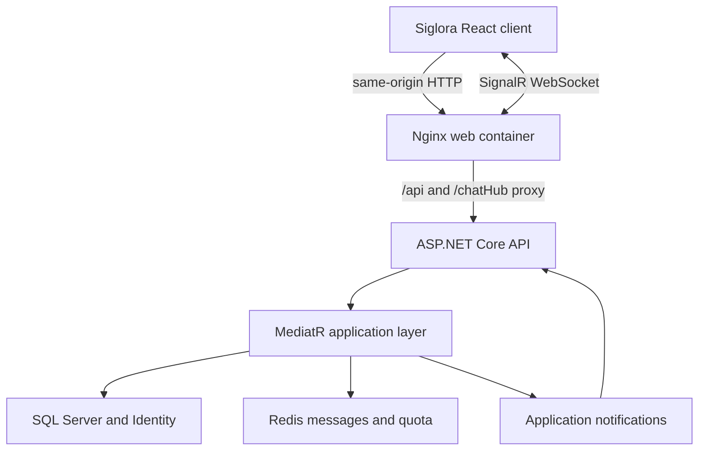

# Siglora

> A portfolio-ready real-time chat application built with ASP.NET Core, SignalR, Redis, SQL Server, React, and TypeScript.

Siglora demonstrates an authenticated, full-stack messaging workflow: users sign in through an HttpOnly cookie, load recent Redis-backed messages, exchange messages in real time, see connection state and online presence, and recover automatically after a temporary API outage.

## Highlights

- Layered .NET 10 backend with MediatR commands, queries, validation, and notifications
- React and TypeScript client with protected routing and session restoration
- SignalR message delivery, automatic reconnect, and connection-aware presence tracking
- Redis sorted-set message history and atomic per-user message quota
- ASP.NET Core Identity, EF Core, SQL Server, and JWT authentication
- RFC Problem Details responses and shared frontend error handling
- Production frontend image built with Node and served by Nginx
- One-command local stack for web, API, SQL Server, and Redis
- Backend, frontend, SignalR, presence, validation, and error-handling tests
- GitHub Actions checks for .NET, React, Compose, and both container images

## Architecture



The web image uses root-relative production URLs. Nginx serves the SPA and proxies `/api` and `/chatHub` to the API, so the browser uses one origin and authentication cookies work for both HTTP and SignalR traffic.

## Core Flows

### Authentication

1. `POST /api/Auth/login` validates the credentials and creates a signed JWT.
2. The API writes the token to an HttpOnly cookie.
3. The client sends credentialed requests without storing the JWT in browser storage.
4. `GET /api/Auth/session` restores the user after a refresh.
5. `POST /api/Auth/logout` clears the browser session.

Swagger can also use the login response token as a bearer credential.

### Messaging

1. The API derives the sender from the authenticated principal.
2. FluentValidation runs through the MediatR pipeline.
3. Redis atomically consumes the user's message quota.
4. The message is stored in the recent-message sorted set.
5. An application notification broadcasts the complete message DTO through SignalR.
6. Clients de-duplicate messages by ID and render the event once.

### Presence and reconnect

Presence is tracked per SignalR connection, not as a single boolean per user. A user remains online while at least one tab is connected. The client retries an interrupted connection and refreshes the online-user list after reconnecting.

## Technology

| Area | Stack |
| --- | --- |
| Backend | C#, .NET 10, ASP.NET Core, SignalR, EF Core, Identity, MediatR, FluentValidation |
| Data | SQL Server, Redis |
| Frontend | React, TypeScript, Vite, React Router, SignalR client |
| Quality | xUnit, Moq, Vitest, Testing Library, ESLint |
| Delivery | Docker, Docker Compose, Nginx, GitHub Actions |

## Project Structure

```text
src/
  core/                Domain, application, contracts, and common code
  infrastructure/      Persistence, Redis/JWT implementations, and composition
  presentation/
    webapi/             ASP.NET Core API and SignalR hub
    webui/              React and TypeScript client
tests/                  Backend test project
docs/                   Architecture, deployment checklist, and release notes
```

## Quick Start: Full Container Stack

### Requirements

- Docker Desktop or Docker Engine with Compose
- Free local ports `5173`, `5258`, `1433`, and `6379` (or change them in `.env`)

Create local configuration:

```powershell
Copy-Item .env.example .env
```

```bash
cp .env.example .env
```

Replace the example SQL, JWT, and demo-user passwords in `.env`, then start every service:

```bash
docker compose up --build -d
docker compose ps
```

| Service | Address |
| --- | --- |
| Siglora web client | `http://localhost:5173` |
| API | `http://localhost:5258` |
| Swagger | `http://localhost:5258/swagger` |
| Health check | `http://localhost:5258/health` |
| SignalR hub | `http://localhost:5258/chatHub` |

Open `http://localhost:5173/login` and use `DEMO_USER_NAME` and `DEMO_USER_PASSWORD` from the root `.env` file. Database migrations and demo-user initialization run automatically only in this local `Development` stack.

Stop the stack without deleting SQL data:

```bash
docker compose down
```

## Frontend Development

Start the API stack, then run Vite separately:

```bash
cd src/presentation/webui/realtimechat.ui
cp .env.example .env.development
npm ci
npm run dev
```

On PowerShell, use `Copy-Item .env.example .env.development` instead of `cp`.

The development environment uses absolute API and hub URLs. The production Docker build uses `/` and `/chatHub`, which Nginx resolves through the same origin.

## Manual Backend Development

Create the ignored local API configuration from the safe example:

```powershell
Copy-Item `
  src/presentation/webapi/RealtimeChat.Api/appsettings.example.json `
  src/presentation/webapi/RealtimeChat.Api/appsettings.Development.json
```

Update the local connection and JWT values, then run:

```bash
dotnet restore RealtimeChat.sln
dotnet ef database update \
  --project src/infrastructure/RealtimeChat.Persistence \
  --startup-project src/presentation/webapi/RealtimeChat.Api
dotnet run --project src/presentation/webapi/RealtimeChat.Api
```

Never commit real credentials, connection strings, signing keys, or production origins.

## Quality Checks

### Backend

Redis-backed tests use database `15` by default:

```bash
docker run --rm -d --name realtimechat-test-redis -p 6379:6379 redis:7-alpine
dotnet test RealtimeChat.sln --configuration Release
docker stop realtimechat-test-redis
```

Set `TEST_REDIS_CONNECTION` to target another isolated Redis instance.

### Frontend

Run from `src/presentation/webui/realtimechat.ui`:

```bash
npm ci
npm run lint
npm run build
npm test
```

## Continuous Integration

GitHub Actions runs independent backend and frontend jobs for pushes and pull requests targeting `master`.

- Backend: restore, Release build, tests with Redis, Compose validation, API image build
- Frontend: deterministic install, lint, production build, tests, web image build

## API Surface

| Type | Route / method | Purpose |
| --- | --- | --- |
| HTTP | `POST /api/Auth/login` | Authenticate and issue a JWT plus HttpOnly cookie |
| HTTP | `GET /api/Auth/session` | Return the current authenticated user |
| HTTP | `POST /api/Auth/logout` | Clear the authentication cookie |
| HTTP | `POST /api/Chat/create` | Create a message as the authenticated user |
| HTTP | `GET /api/Chat/messages` | Read recent Redis-backed messages |
| HTTP | `GET /health` | Report API liveness |
| SignalR | `/chatHub` | Authenticated real-time connection |
| Hub | `SendMessage` | Validate, persist, and broadcast a message |
| Hub | `Join` | Publish the user's join event |
| Hub | `GetOnlineUsers` | Broadcast the current online-user list |

## Security Decisions

- Browser authentication uses an HttpOnly cookie.
- JWTs are not persisted in local storage or session storage.
- Protected API endpoints and the SignalR hub require authentication.
- Sender identity comes from trusted JWT claims, not request payloads.
- Validation and operational errors use Problem Details.
- Redis quota consumption is atomic.
- Demo credentials are restricted to the local Development environment.
- Configuration examples contain disposable values only.

## Scope and Deployment Status

Version `v1.0.0` is the portfolio baseline: the application, container definitions, automated tests, and deployment checklist are ready for review. It is **not currently published to the homelab**. The production rollout is intentionally deferred until the target server is available; see [docs/deployment.md](docs/deployment.md).

Current boundaries:

- Presence is connection-aware within one API process; multi-instance deployments require a shared presence store and SignalR backplane.
- Registration and password-bootstrap endpoints are outside the demo scope.
- Redis message retention trimming and broader SQL integration coverage remain follow-ups.
- Production TLS, secret management, backups, observability, and load testing must be completed during deployment.

This repository is a portfolio and architecture sample, not a turnkey public chat service.

## Documentation

- [Architecture decisions](docs/architecture.md)
- [Deployment checklist](docs/deployment.md)
- [v1.0.0 release notes](docs/release-notes-v1.0.0.md)
- [Changelog](CHANGELOG.md)

## Author

[Ekrem Güngör](https://github.com/Ekrem-Gungor) · [LinkedIn](https://www.linkedin.com/in/ekrem-güngör)
