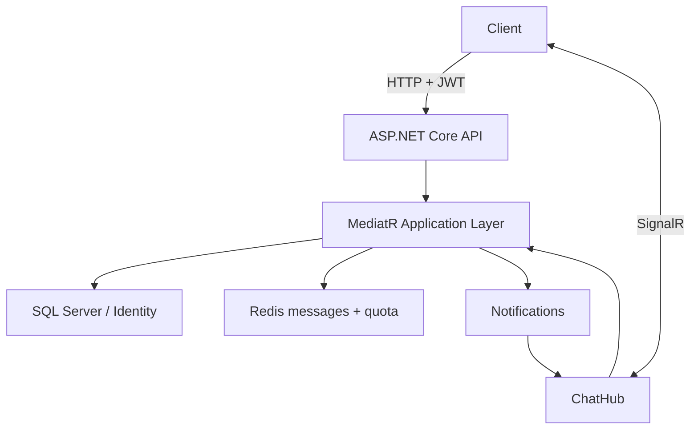

# DevBudy Live Chat API

> A real-time chat backend built with ASP.NET Core, SignalR, Redis, SQL Server, MediatR, and ASP.NET Core Identity.

## Overview

DevBudy is an educational backend project focused on real-time messaging and layered .NET application design. It exposes HTTP endpoints for authentication and message history, while SignalR distributes chat events and online-user updates to connected clients.

The current repository contains the backend API. A production-ready web client is not included.

## Highlights

- Real-time message and system-event delivery with SignalR
- JWT bearer authentication for HTTP and SignalR connections
- ASP.NET Core Identity with role and profile models
- Redis sorted sets for recent message storage
- Redis-backed per-user message quota
- SQL Server persistence with Entity Framework Core
- MediatR commands, queries, and notifications
- Onion-style separation between domain, application, infrastructure, and presentation
- Autofac-based dependency registration
- Swagger in the Development environment

## Architecture



## Request Flow

1. The client authenticates through `POST /api/auth/login`.
2. The API returns a signed JWT containing the user identifier, username, email, and roles.
3. HTTP chat operations send the token as a bearer credential.
4. SignalR uses the `access_token` query parameter during the `/chatHub` handshake.
5. The server derives the sender identity from the authenticated principal rather than trusting a client-supplied username.
6. Message quota is checked and consumed in Redis.
7. The message is stored in a Redis sorted set and published through a MediatR notification.
8. The SignalR event handler broadcasts the result to connected clients.

## Project Structure

```text
src/
├── core/
│   ├── DevBudy.DOMAIN
│   ├── DevBudy.APPLICATION
│   ├── DevBudy.CONTRACT
│   └── DevBudy.COMMON
├── infrastructure/
│   ├── DevBudy.PERSISTANCE
│   ├── DevBudy.INNERINFRASTRUCTURE
│   └── DevBudy.DEPENDENCYRESOLVER
└── presentation/
    └── webapi/DevBudy.API
```

## Technology Stack

`C#` · `.NET 8` · `ASP.NET Core Web API` · `SignalR` · `Entity Framework Core` · `ASP.NET Core Identity` · `SQL Server` · `Redis` · `MediatR` · `Autofac` · `AutoMapper` · `JWT` · `Swagger`

## Local Setup

### Prerequisites

- .NET 8 SDK
- SQL Server
- Redis
- EF Core CLI (`dotnet-ef`)

### Configuration

Copy the safe example file:

```bash
cp src/presentation/webapi/DevBudy.API/appsettings.example.json \
   src/presentation/webapi/DevBudy.API/appsettings.Development.json
```

Then replace the example JWT secret and adjust the SQL Server, Redis, and CORS values for your environment. Local configuration files are ignored by Git.

Never commit real connection strings, JWT signing keys, Redis credentials, or production origins.

### Database and API

```bash
dotnet restore SignalRLiveChatApp.sln

dotnet ef database update \
  --project src/infrastructure/DevBudy.PERSISTANCE \
  --startup-project src/presentation/webapi/DevBudy.API

dotnet run --project src/presentation/webapi/DevBudy.API
```

The default HTTP launch profile listens on `http://localhost:5258`. Swagger is available at `/swagger` in Development.

## Authentication Note

Repository seed identities use reserved `example.invalid` addresses and do not contain usable passwords. Create development credentials locally rather than placing shared demo passwords in source control.

Protected chat operations and the SignalR hub require an authenticated user. The hub accepts its bearer token through the standard SignalR `access_token` handshake parameter.

## API Surface

| Type | Route / Method | Purpose |
|---|---|---|
| HTTP | `POST /api/auth/login` | Authenticate and generate a JWT |
| HTTP | `POST /api/chat/create` | Create a message as the authenticated user |
| HTTP | `GET /api/chat/messages` | Read recent Redis-backed messages |
| SignalR | `/chatHub` | Authenticated real-time connection |
| Hub | `SendMessage` | Validate quota, persist, and broadcast a message |
| Hub | `Join` | Broadcast a system join event |
| Hub | `GetOnlineUsers` | Broadcast the current online-user list |

## Security Improvements Applied

- Personal seed data was replaced with anonymous reserved-domain identities.
- Seeded users no longer contain password hashes for shared public credentials.
- Chat HTTP endpoints and `ChatHub` require authorization.
- Sender and join identity are derived from JWT claims, not trusted client input.
- Local configuration and environment files are excluded from source control.
- The previous push-to-production workflow was replaced with a build-only CI workflow.

## Current Limitations

- No registration or password-bootstrap endpoint is provided.
- No automated test suite is currently included.
- Redis and SQL Server must be provisioned separately.
- Message quota is implemented as an application feature, not a distributed abuse-prevention system.
- Online status is stored in SQL and may need reconciliation after abnormal disconnects.
- The repository does not include a production web client.
- Production deployment, secret rotation, rate limiting, observability, and load testing require additional work.

This project should be evaluated as a technical learning project and architecture sample, not as a turnkey production chat service.

## Author

[Ekrem Güngör](https://github.com/Ekrem-Gungor) · [LinkedIn](https://www.linkedin.com/in/ekrem-güngör)
