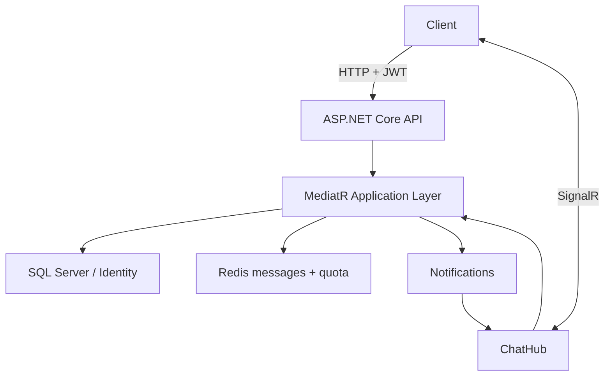

# RealtimeChat

> A real-time chat backend built with ASP.NET Core, SignalR, Redis, SQL Server, MediatR, and ASP.NET Core Identity.

## Overview

RealtimeChat is a portfolio-oriented backend project focused on real-time messaging and layered .NET application design. It exposes HTTP endpoints for authentication and message history, while SignalR distributes chat events and online-user updates to connected clients.

The current repository contains the backend API. A production-ready web client is not included.

## Highlights

- Real-time message and system-event delivery with SignalR
- JWT bearer authentication for HTTP and SignalR connections
- ASP.NET Core Identity with role and profile models
- Redis sorted sets for recent message storage
- Atomic Redis-backed per-user message quota
- SQL Server persistence with Entity Framework Core
- MediatR commands, queries, and notifications
- Onion-style separation between domain, application, infrastructure, and presentation
- Single composition root with built-in ASP.NET Core dependency injection
- Centralized target framework and NuGet package versions
- Swagger in the Development environment

## Architecture



## Request Flow

1. The client authenticates through `POST /api/auth/login`.
2. The API returns a signed JWT containing the user identifier, username, email, and roles.
3. HTTP chat operations send the token as a bearer credential.
4. SignalR uses the `access_token` query parameter during the `/chatHub` handshake; browser clients can also use the HTTP-only access-token cookie.
5. The server derives the sender identity from the authenticated principal rather than trusting a client-supplied username.
6. Message quota is initialized and consumed atomically in Redis.
7. The message is stored in a Redis sorted set and published through a MediatR notification.
8. The SignalR event handler broadcasts the result to connected clients.

## Project Structure

```text
src/
├── core/
│   ├── RealtimeChat.Domain
│   ├── RealtimeChat.Application
│   ├── RealtimeChat.Contracts
│   └── RealtimeChat.Common
├── infrastructure/
│   ├── RealtimeChat.Persistence
│   ├── RealtimeChat.Infrastructure
│   └── RealtimeChat.DependencyInjection
└── presentation/
    └── webapi/RealtimeChat.Api
```

## Technology Stack

`C#` · `.NET 10` · `ASP.NET Core Web API` · `SignalR` · `Entity Framework Core` · `ASP.NET Core Identity` · `SQL Server` · `Redis` · `MediatR` · `JWT` · `Swagger`

## Local Setup

### Docker Compose

The quickest development setup starts the API, SQL Server, and Redis together:

```bash
cp .env.example .env
docker compose up --build -d
docker compose ps
```

The API is available at `http://localhost:5258`, Swagger at `/swagger`, and the liveness endpoint at `/health`. Database migrations run automatically only in the Compose `Development` environment.

Compose also creates one local demo identity from the values in `.env`:

- Username: `DEMO_USER_NAME`
- Password: `DEMO_USER_PASSWORD`

The example values are intended only for the local disposable environment. Demo identity initialization is opt-in and the application refuses to run it outside `Development`.

### Try the authenticated API in Swagger

1. Open `http://localhost:5258/swagger`.
2. Expand `POST /api/Auth/login` and select **Try it out**.
3. Use `DEMO_USER_NAME` and `DEMO_USER_PASSWORD` from your local `.env` file.
4. Copy the `token` value from the successful response.
5. Select **Authorize** at the top of Swagger UI and paste only the token. Swagger adds the `Bearer` prefix automatically.
6. Call `GET /api/Chat/messages` or `POST /api/Chat/create`.

Swagger marks only protected operations with a lock icon. Validation, authentication, quota, and unexpected failures are documented with their ProblemDetails response contracts.

Stop the stack without deleting SQL Server data:

```bash
docker compose down
```

To remove the local database volume as well, run `docker compose down --volumes` intentionally.

### Manual Setup

### Prerequisites

- .NET 10 SDK
- SQL Server
- Redis
- EF Core CLI (`dotnet-ef`)

### Configuration

Copy the safe example file:

```bash
cp src/presentation/webapi/RealtimeChat.Api/appsettings.example.json \
   src/presentation/webapi/RealtimeChat.Api/appsettings.Development.json
```

Then replace the example JWT secret and adjust the SQL Server, Redis, and CORS values for your environment. Local configuration files are ignored by Git. Deployment settings can use standard ASP.NET Core environment variables such as `ConnectionStrings__RealtimeChatConnection`, `JwtSettings__SecretKey`, `Redis`, and `UICORSPath`.

Never commit real connection strings, JWT signing keys, Redis credentials, or production origins.

### Database and API

```bash
dotnet restore RealtimeChat.sln

dotnet ef database update \
  --project src/infrastructure/RealtimeChat.Persistence \
  --startup-project src/presentation/webapi/RealtimeChat.Api

dotnet run --project src/presentation/webapi/RealtimeChat.Api
```

The default HTTP launch profile listens on `http://localhost:5258`. Swagger is available at `/swagger` in Development.

### Tests

The test suite includes application tests and Redis-backed integration tests. Redis tests use database `15` by default so development data remains isolated.

```bash
docker run --rm -d --name realtimechat-test-redis -p 6379:6379 redis:7-alpine
dotnet test RealtimeChat.sln --configuration Release
docker stop realtimechat-test-redis
```

Set `TEST_REDIS_CONNECTION` to use a different isolated Redis instance. CI provisions its own Redis service automatically.

## Authentication Note

Repository seed identities use reserved `example.invalid` addresses and do not contain usable passwords. The Docker workflow creates a separate local demo identity from `.env`; production environments must keep `DemoIdentity:Enabled` disabled.

Protected chat operations and the SignalR hub require an authenticated user. The hub accepts its bearer token through the standard SignalR `access_token` handshake parameter.

The application validates credentials without creating an Identity application cookie. JWT creation stays in the application flow, while the API owns the HTTP-only cookie response.

## API Surface

| Type | Route / Method | Purpose |
|---|---|---|
| HTTP | `POST /api/auth/login` | Authenticate and generate a JWT |
| HTTP | `POST /api/chat/create` | Create a message as the authenticated user |
| HTTP | `GET /api/chat/messages` | Read recent Redis-backed messages |
| HTTP | `GET /health` | Liveness check for local and hosted environments |
| SignalR | `/chatHub` | Authenticated real-time connection |
| Hub | `SendMessage` | Validate quota, persist, and broadcast a message |
| Hub | `Join` | Broadcast a system join event |
| Hub | `GetOnlineUsers` | Broadcast the current online-user list |

## Security Improvements Applied

- Personal seed data was replaced with anonymous reserved-domain identities.
- Seeded users no longer contain password hashes for shared public credentials.
- Chat HTTP endpoints and `ChatHub` require authorization.
- Sender and join identity are derived from JWT claims, not trusted client input.
- Local configuration and environment files are excluded from source control.
- The previous push-to-production workflow was replaced with restore, build, test, Compose validation, and container-build checks.
- Quota validation and decrement run as one Redis operation to avoid concurrent double-spending.

## Current Limitations

- No registration or password-bootstrap endpoint is provided.
- The initial automated suite covers critical authentication and Redis flows; broader API and SQL integration coverage is still planned.
- Docker Compose covers local infrastructure; production infrastructure and deployment remain environment-specific.
- Message quota is a fixed-window Redis control, not a complete abuse-prevention system.
- Online status is stored in SQL and may need reconciliation after abnormal disconnects.
- The repository does not include a production web client.
- Production deployment, secret rotation, rate limiting, observability, and load testing require additional work.

This project should be evaluated as a technical learning project and architecture sample, not as a turnkey production chat service.

## Author

[Ekrem Güngör](https://github.com/Ekrem-Gungor) · [LinkedIn](https://www.linkedin.com/in/ekrem-güngör)
