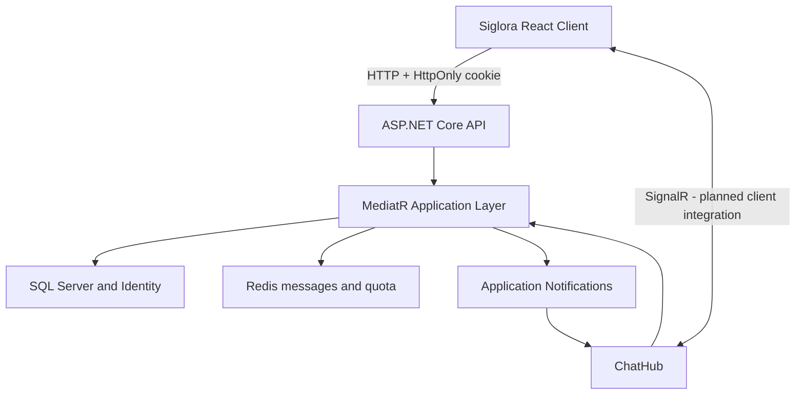

# Siglora (RealtimeChat)

> A portfolio-oriented real-time chat application built with ASP.NET Core, SignalR, Redis, SQL Server, React, and TypeScript.

## Overview

Siglora is the product-facing name of the RealtimeChat project.

The repository demonstrates a layered .NET backend, Redis-backed messaging controls, JWT authentication, standardized API errors, and a React web client with protected routing and session restoration.

The web client currently includes the authentication foundation and authenticated application shell. Real-time SignalR messaging in the browser is the next implementation stage.

## Highlights

### Backend

- ASP.NET Core Web API and SignalR
- JWT authentication for HTTP and hub connections
- HttpOnly authentication cookie for the browser client
- ASP.NET Core Identity with role and profile models
- SQL Server persistence with Entity Framework Core
- Redis sorted sets for recent message storage
- Atomic Redis-backed per-user message quota
- MediatR commands, queries, and notifications
- RFC Problem Details error responses
- FluentValidation request validation
- Onion-style architectural separation
- Swagger authentication support
- Automated database migration in the local Compose environment

### Frontend

- React and TypeScript
- Vite development and production builds
- Protected and public-only routes
- Login, logout, and session restoration
- Credentialed API requests
- Centralized HTTP and Problem Details handling
- Responsive authenticated application shell
- Vitest and Testing Library coverage

### Delivery

- Docker Compose for API, SQL Server, and Redis
- GitHub Actions backend and frontend quality checks
- API container build validation
- Safe example configuration files

## Architecture



## Authentication Flow

1. The client submits credentials to `POST /api/Auth/login`.
2. The API validates the credentials and generates a signed JWT.
3. The JWT is returned in the response and written to an HttpOnly cookie.
4. The browser client sends the cookie automatically with credentialed requests.
5. `GET /api/Auth/session` restores the authenticated user after a page refresh.
6. `POST /api/Auth/logout` removes the authentication cookie.
7. Protected routes redirect anonymous users to `/login`.
8. The web client does not store the JWT in local storage or session storage.

Swagger can use the token returned from the login response as a bearer credential. The browser client uses the HttpOnly cookie.

## Message Flow

1. An authenticated user submits a message.
2. The server derives the sender identity from the authenticated principal.
3. Message validation runs through the MediatR pipeline.
4. The user quota is checked and consumed atomically in Redis.
5. The message is stored in a Redis sorted set.
6. An application notification publishes the message through SignalR.
7. Connected clients receive the resulting event.

## Project Structure

```text
src/
  core/
    RealtimeChat.Domain
    RealtimeChat.Application
    RealtimeChat.Contracts
    RealtimeChat.Common

  infrastructure/
    RealtimeChat.Persistence
    RealtimeChat.Infrastructure
    RealtimeChat.DependencyInjection

  presentation/
    webapi/
      RealtimeChat.Api

    webui/
      realtimechat.ui

tests/
  RealtimeChat.Tests
```

The React client uses feature-oriented organization:

```text
src/presentation/webui/realtimechat.ui/src/
  app/         Application routing and route guards
  features/    Feature modules such as authentication
  shared/      Shared API and configuration code
  styles/      Global application styles
  test/        Shared test setup
  main.tsx     Application entry point
```

## Technology Stack

### Backend

`C#` · `.NET 10` · `ASP.NET Core Web API` · `SignalR` · `Entity Framework Core` · `ASP.NET Core Identity` · `SQL Server` · `Redis` · `MediatR` · `FluentValidation` · `JWT` · `Swagger`

### Frontend

`React` · `TypeScript` · `Vite` · `React Router` · `Vitest` · `Testing Library` · `ESLint`

### Infrastructure

`Docker` · `Docker Compose` · `GitHub Actions`

## Local Setup

### Prerequisites

- Docker Desktop
- .NET 10 SDK
- Node.js 22
- npm

## Run the Backend with Docker Compose

Copy the example environment file:

### PowerShell

```powershell
Copy-Item .env.example .env
```

### Bash

```bash
cp .env.example .env
```

Start the API, SQL Server, and Redis:

```bash
docker compose up --build -d
docker compose ps
```

Available backend endpoints:

| Service      | Address                         |
| ------------ | ------------------------------- |
| API          | `http://localhost:5258`         |
| Swagger      | `http://localhost:5258/swagger` |
| Health check | `http://localhost:5258/health`  |
| SignalR hub  | `http://localhost:5258/chatHub` |

Database migrations run automatically in the Compose `Development` environment.

The local stack also creates a demo user using these `.env` values:

- `DEMO_USER_NAME`
- `DEMO_USER_EMAIL`
- `DEMO_USER_PASSWORD`

The example credentials are intended only for disposable local development. Demo identity initialization is disabled outside the Development environment.

## Run the Web Client

Move to the frontend directory:

```bash
cd src/presentation/webui/realtimechat.ui
```

Copy the frontend environment file:

### PowerShell

```powershell
Copy-Item .env.example .env.development
```

### Bash

```bash
cp .env.example .env.development
```

Install dependencies and start Vite:

```bash
npm ci
npm run dev
```

The web client is available at:

```text
http://localhost:5173
```

The backend must be running at the address configured by `VITE_API_BASE_URL`.

## Try the Application

1. Start the backend stack.
2. Start the React development server.
3. Open `http://localhost:5173/login`.
4. Use `DEMO_USER_NAME` and `DEMO_USER_PASSWORD` from the root `.env` file.
5. Confirm that successful authentication redirects to `/chat`.
6. Refresh the page to verify session restoration.
7. Use the logout action to remove the session.

The current `/chat` route provides the authenticated application shell. Browser-based real-time messaging will be added in the next implementation stage.

## Use Swagger Authentication

1. Open `http://localhost:5258/swagger`.
2. Execute `POST /api/Auth/login`.
3. Use the demo credentials from the root `.env` file.
4. Copy the `token` value from the response.
5. Select **Authorize**.
6. Paste only the token; Swagger adds the `Bearer` prefix.
7. Call a protected chat endpoint.

## Manual Backend Setup

Copy the safe API configuration example:

```powershell
Copy-Item `
  src/presentation/webapi/RealtimeChat.Api/appsettings.example.json `
  src/presentation/webapi/RealtimeChat.Api/appsettings.Development.json
```

Update the local SQL Server, Redis, JWT, and CORS settings. Local development configuration files are ignored by Git.

Apply migrations and run the API:

```bash
dotnet restore RealtimeChat.sln

dotnet ef database update \
  --project src/infrastructure/RealtimeChat.Persistence \
  --startup-project src/presentation/webapi/RealtimeChat.Api

dotnet run --project src/presentation/webapi/RealtimeChat.Api
```

Never commit real connection strings, JWT signing keys, Redis credentials, production origins, or private user credentials.

## Quality Checks

### Backend

Redis-backed tests use database `15` by default to keep test data isolated.

```bash
docker run --rm -d --name realtimechat-test-redis -p 6379:6379 redis:7-alpine
dotnet test RealtimeChat.sln --configuration Release
docker stop realtimechat-test-redis
```

Set `TEST_REDIS_CONNECTION` to use a different isolated Redis instance.

### Frontend

Run these commands from `src/presentation/webui/realtimechat.ui`:

```bash
npm ci
npm run lint
npm run build
npm test
```

Use watch mode during development:

```bash
npm run test:watch
```

## Continuous Integration

GitHub Actions runs two independent jobs for pushes and pull requests targeting `master`.

### Backend quality

- Restore the .NET solution
- Build in Release mode
- Run automated tests with Redis
- Validate Docker Compose
- Build the API container image

### Frontend quality

- Install dependencies using `npm ci`
- Run ESLint
- Create a production build
- Run Vitest tests

## API Surface

| Type    | Route / Method           | Purpose                                          |
| ------- | ------------------------ | ------------------------------------------------ |
| HTTP    | `POST /api/Auth/login`   | Authenticate and issue a JWT and HttpOnly cookie |
| HTTP    | `GET /api/Auth/session`  | Return the current authenticated user            |
| HTTP    | `POST /api/Auth/logout`  | Remove the authentication cookie                 |
| HTTP    | `POST /api/Chat/create`  | Create a message as the authenticated user       |
| HTTP    | `GET /api/Chat/messages` | Read recent Redis-backed messages                |
| HTTP    | `GET /health`            | Report application liveness                      |
| SignalR | `/chatHub`               | Provide the authenticated real-time connection   |
| Hub     | `SendMessage`            | Validate, persist, and broadcast a message       |
| Hub     | `Join`                   | Broadcast a system join event                    |
| Hub     | `GetOnlineUsers`         | Broadcast the current online-user list           |

## Security Decisions

- Browser authentication uses an HttpOnly cookie.
- The client does not persist JWTs in browser storage.
- Protected API operations and the SignalR hub require authentication.
- Sender identity is derived from trusted JWT claims.
- Validation failures use standardized Problem Details responses.
- Message quota consumption is atomic in Redis.
- Seeded identities use reserved `example.invalid` addresses.
- Demo credentials are limited to local development.
- Local configuration files are excluded from source control.
- CI validates builds, tests, Compose configuration, and the API image.

## Current Limitations

- Browser-based SignalR messaging is not implemented yet.
- Registration and password-bootstrap endpoints are not provided.
- The authenticated chat screen is currently an application shell.
- Online-state reconciliation may be required after abnormal disconnections.
- Docker Compose currently runs backend infrastructure, not the React development server.
- Production deployment, secret rotation, observability, load testing, and broader integration coverage require additional work.

This repository is a technical learning project and architecture sample rather than a turnkey production chat platform.

## Author

[Ekrem Güngör](https://github.com/Ekrem-Gungor) · [LinkedIn](https://www.linkedin.com/in/ekrem-güngör)
