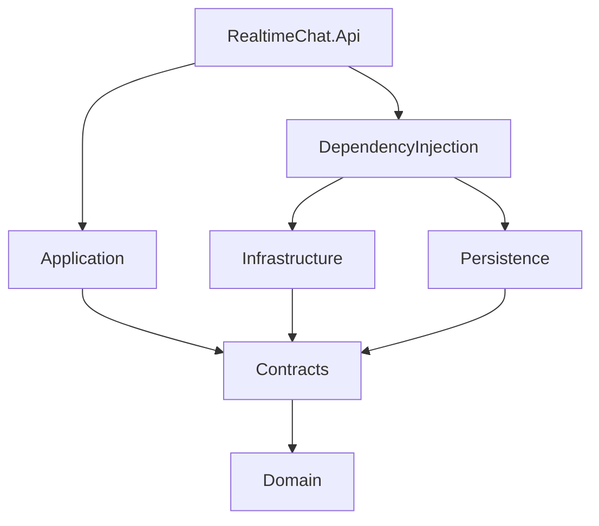
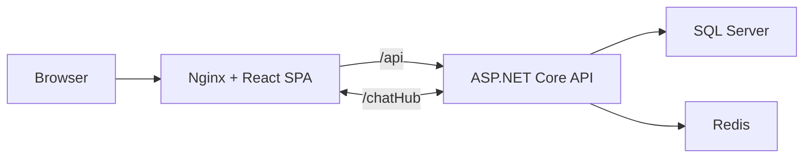

# Architecture

Siglora uses a pragmatic layered structure. Business workflows live in the application project, infrastructure projects implement external concerns, and the presentation layer owns HTTP, cookies, SignalR, and the React client.

## Project Responsibilities

| Project | Responsibility |
| --- | --- |
| `RealtimeChat.Domain` | Entities, enums, and cache models |
| `RealtimeChat.Contracts` | Repository boundaries shared by application and infrastructure |
| `RealtimeChat.Application` | Commands, queries, DTOs, validation, notifications, and use-case orchestration |
| `RealtimeChat.Persistence` | EF Core context, mappings, migrations, and SQL repositories |
| `RealtimeChat.Infrastructure` | JWT generation and Redis repository implementations |
| `RealtimeChat.DependencyInjection` | Composition, configuration validation, and service registration |
| `RealtimeChat.Api` | HTTP endpoints, cookie transport, SignalR hub, connection tracking, and broadcasts |
| `realtimechat.ui` | React routes, session state, messaging UI, SignalR lifecycle, and client errors |

## Runtime Topology

The production web build uses root-relative endpoints. Nginx provides SPA fallback and proxies API and WebSocket traffic to the API container. Local Vite development instead uses absolute endpoints from `.env.development`.

## Key Decisions

### Authentication boundary

The application layer validates credentials and creates token data without accessing `HttpContext`. Cookie creation remains in `AuthController`, where HTTP response behavior belongs. Password validation uses `CheckPasswordSignInAsync`, so JWT login does not also create an Identity application cookie.

### Complete message contract

The command handler creates one `ChatMessageDto`, persists its Redis representation, publishes that DTO in an application notification, and returns the same contract to HTTP callers. Both transports therefore expose the same message ID and sender data. The client de-duplicates concurrent HTTP and SignalR results by message ID.

### Redis message storage

Recent messages share the `chat:messages` sorted-set key. Unix time is the score, enabling efficient time-window queries.

### Redis quota

The key format is `chat:quota:{userId}`. A Lua script lazily creates the one-hour quota and consumes one allowance in a single Redis operation, preventing concurrent requests from spending the same allowance.

### Connection-aware presence

The API tracks SignalR connection IDs per authenticated user. Disconnecting one tab marks the user offline only after the final connection closes. This fixes the common multi-tab presence race while keeping the implementation small.

The tracker is process-local. Before scaling the API horizontally, move presence to a shared store and add a SignalR backplane or managed SignalR service.

### Reconnect behavior

The client uses SignalR automatic reconnect and a retry loop for failures that occur before the first successful connection. On reconnect it requests a fresh online-user list, so an API restart does not require a browser refresh.

### Database migrations

Automatic migrations are opt-in and limited to `Development`. The local Compose stack enables them. A production release must run migrations as an explicit deployment step.

### Demo identity

The local demo identity is configured by environment variables and created idempotently after migrations. Initialization fails fast if enabled outside `Development`.

## Known Follow-ups

- Add SQL Server integration tests with a disposable database.
- Add Redis retention trimming for the message sorted set.
- Replace process-local presence when introducing multiple API replicas.
- Add production telemetry, structured log aggregation, and alerting.
- Consider separating Identity inheritance from the domain model if the system grows beyond portfolio scope.
