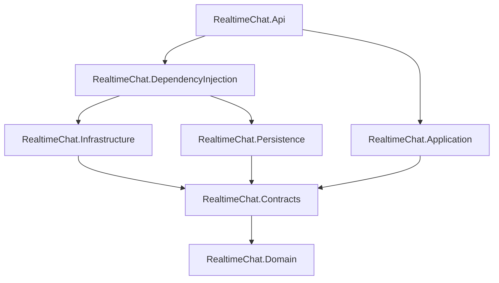

# Architecture

RealtimeChat follows a pragmatic layered structure. Business use cases live in the application project, implementation details remain in infrastructure projects, and the API is responsible for HTTP and SignalR concerns.

## Responsibilities

| Project | Responsibility |
|---|---|
| `RealtimeChat.Domain` | Entities, enums, and cache models |
| `RealtimeChat.Contracts` | Repository boundaries shared by application and infrastructure |
| `RealtimeChat.Application` | Commands, queries, DTOs, notifications, and use-case orchestration |
| `RealtimeChat.Persistence` | EF Core context, mappings, migrations, and SQL repositories |
| `RealtimeChat.Infrastructure` | JWT generation and Redis repository implementations |
| `RealtimeChat.DependencyInjection` | Application composition, configuration validation, and service registration |
| `RealtimeChat.Api` | HTTP endpoints, authentication cookie transport, SignalR hub, and broadcast handlers |

## Key Decisions

### Authentication boundary

The application layer validates credentials and creates token data. It does not access `HttpContext`. Cookie creation stays in `AuthController`, where HTTP response behavior belongs. Password validation uses `CheckPasswordSignInAsync`, so JWT login does not also create an Identity application cookie.

### Redis message storage

Recent messages share the `chat:messages` sorted-set key. The Unix timestamp is used as the score, allowing efficient time-window queries.

### Redis quota

The key format is `chat:quota:{userId}`. A Lua script lazily creates the one-hour quota and consumes one message allowance in the same Redis operation. This prevents simultaneous requests from consuming the same remaining allowance.

### Dependency registration

The solution uses the built-in ASP.NET Core container. `AddRealtimeChat` is the only composition entry point and scans both application handlers and API notification handlers for MediatR registrations.

### Database migrations

Automatic migrations are opt-in and restricted to the `Development` environment. Docker Compose enables them for the local stack; production environments must run migrations as an explicit deployment step.

### Demo identity

The local demo identity is configured through environment variables and created idempotently after migrations. The initializer is disabled by default and fails fast if it is enabled outside `Development`.

## Known Follow-ups

- Expand authentication and Redis coverage beyond the critical baseline scenarios.
- Add SQL Server integration tests with a disposable database instance.
- Move online presence to a connection-aware store so multiple tabs and abnormal disconnects are handled correctly.
- Add retention trimming for the Redis message sorted set.
- Consider separating Identity inheritance from the domain model if the project grows beyond its current scope.
